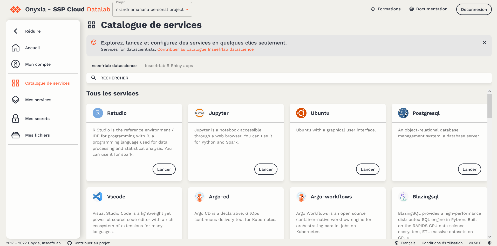
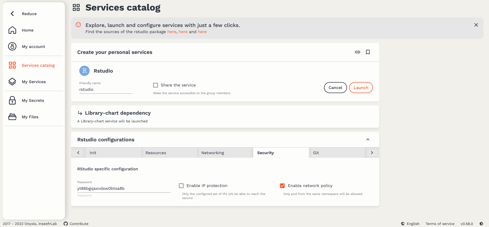
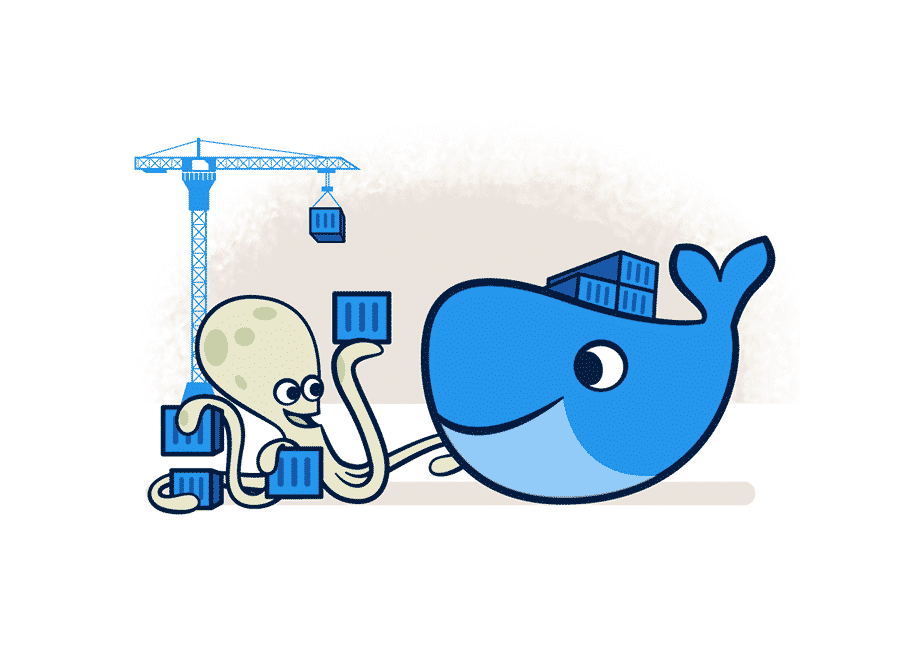

# TP 0 — Partie 1: Découverte d'Onyxia et de son datalab SSP Cloud

:warning: Ce TP est un glow up de cette [version](#version-aws-du-tp-by-rémi-pépin) (cliquez et prenez tout en bas de la page) qui sera présenté à vos collègues en ingé 😉

Menu du jour :

- [TP 0 — Partie 1: Découverte d'Onyxia et de son datalab SSP Cloud](#tp-0---partie-1--d-couverte-d-onyxia-et-de-son-datalab-ssp-cloud)
  * [Objectifs](#objectifs)
  * [1. Création d'un compte sur le SSP Cloud d'Onyxia](#1-création-dun-compte-sur-le-ssp-cloud-donyxia)
  * [2. Exploration](#2-exploration)
  * [3 Accès à votre espace de stockage MinIO : l'alternative open source à Amazon Simple Storage Service (S3)](#3-accès-à-votre-espace-de-stockage-minio--lalternative-open-source-à-amazon-simple-storage-service-s3)
  * [4. Copie des données dans votre espace de stockage](#4-copie-des-données-dans-votre-espace-de-stockage)
  * [5. Lancement d'un service](#5-lancement-dun-service)
  * [7. Le terminal, un outil bien pratique](#7-le-terminal-un-outil-bien-pratique)
    + [7.1 Ouvrir un terminal sur son service](#71-ouvrir-un-terminal-sur-son-service)
    + [7.2 Le terminal, un outil pour gérer ses services en ligne de commande](#72-le-terminal-un-outil-pour-gérer-ses-services-en-ligne-de-commande)
      - [Petite mise en contexte:](#721-petite-mise-en-contexte)
      - [Superviser des services d'Onyxia](#722-superviser-des-services-donyxia)
      - [Des avantages qui changent beaucoup la donne:](#723-des-avantages-qui-changent-beaucoup-la-donne)
    
      
  * [8. Jouer avec son service](#8-jouer-avec-son-service)
    + [8.1 Mise en place des fichiers du TP](#81-mise-en-place-des-fichiers-du-tp)
    + [8.2 Installer R et un package python](#82-installer-r-et-un-package-python)
    + [8.3 Benchmark des langages](#83-benchmark-des-langages)
  * [9. Eteindre son service](#9-eteindre-son-service)
  * [10. Et si on recommence ?](#10-et-si-on-recommence-)

## Objectifs

Dans un premier temps, ce TP a pour but de prendre en main l'interface du datalab [SSP Cloud](https://datalab.sspcloud.fr/home), une instance du logiciel open source [Onyxia](https://github.com/InseeFrLab). 

Pendant ce TP vous allez :

- Créer un compte sur le SSP Cloud si ce n'est pas déjà fait 
- Copier des données dans votre espace de stockage MinIO (S3)
- Lancer un service
- Exécuter différentes commandes de base 
  - `ls` pour lister les documents dans un dossier
  - `cd` pour change directory pour naviguer dans une arborescence de fichiers
  - `apt-get` pour installer un package
  - `mc cp` pour copier des fichiers depuis un bucket MinIO (S3)
  - `chmod` pour changer les permissions d'un fichier
  - `time [commande]` pour mesurer la temps d'exécution d'une commande
  - `kubectl get pods` pour lister les services/pods en cours de lancement
- Eteindre votre service


## 1. Création d'un compte sur le SSP Cloud d'Onyxia :key:

Il est nécessaire de disposer d’un compte personnel SSP Cloud pour en utiliser les services. Si vous n’avez pas de compte sur le SSP Cloud, vous pouvez vous en créer un en cliquant sur ce lien (https://datalab.sspcloud.fr/home) puis suivre les indications dans l'onglet `Connexion`. Deux points sont importants à noter :
- vous devez utiliser votre adresse mail ENSAI
- votre nom d’utilisateur ne doit contenir ni caractères accentués, ni caractère spécial, ni signe de ponctuation. Ce point est essentiel, car votre compte ne fonctionnera pas si votre nom d’utilisateur comprend l’un de ces caractères. Par exemple, si vous vous appelez Jérôme-Gérard L’Hâltère, votre nom d’utilisateur pourra être jeromegerardlhaltere.

Par défaut, l’interface du SSP Cloud est en anglais. Pour choisir le français, vous avez le choix entre:
  - cliquer en bas à droite de la fenêtre puis choisir le français dans les options proposées
  - cliquer sur `My account` dans le menu de gauche puis dans l’onglet `Interface preferences` vous pouvez changer la langue dans la fenêtre qui s’affiche.


## 2. Exploration

Mais d'abord, pourquoi parle t-on de Datalab ? Un Datalab est un espace dédié à l’expérimentation de nouveaux outils. Il permet d’explorer des jeux de données, de la traiter, et de tester différents algorithmes de machine learning par exemple. 

Le SSP Cloud est un datalab. Cette plateforme permet aux statisticiens d’utiliser un grand nombre de logiciels de data science dans un environnement informatique ergonomique et performant.

Et [Onyxia](https://github.com/InseeFrLab) alors ? Késako ? Onyxia est un projet open-source qui permet de créer des plateformes de data science. Le SSP Cloud en est une instance, hébergée sur les serveurs de l'Insee. Cette instance, dédiée à l'open-data (données non-sensibles), est ouverte à tous les agents publics, et aux écoles de statistique de l'Insee (ENSAI, ENSAE, CEFIL). Vous pouvez tout à fait créer votre propre Datalab en créant une autre instance d'Onyxia pour votre organisation, entreprise, association, communauté ou une utilisation personnelle par exemple, à condition de disposer de ses propres serveurs (précisément d'un cluster kubernetes).



Dans l'onglet “**Catalogue de services**”, vous trouverez, entre autres :

- VS Code, votre éditeur de code préféré 
- R Studio, l'environnement phare pour manipuler R 
- Postgresql, bien pratique pour vos bases de données
- Bien d'autres services dédiés à _l'analyse de données_, à la _Dataviz_, aux _calculs distribués_, au _data engineering_, au _DevOps_, au _ML Ops_, au _machine-learning_...


## 3 Accès à votre espace de stockage MinIO : l'alternative open source à Amazon Simple Storage Service (S3)

Le système S3 (Simple Storage System) est un système de stockage développé par Amazon et qui est maintenant devenu une référence pour le stockage en ligne. Il s’agit d’une architecture à la fois sécurisée (données cryptées, accès restreints) et performante. Il y a plus d'un moyen d'utiliser ce fameux système.

**Amazon Simple Storage Service** (S3) est la solution de base que propose AWS pour stocker vos données de manière pérenne. Amazon dit assurer une durabilité de vos données de 99,999999999 %. Cela signifie que si vous stockez 10 000 000 fichiers avec Amazon S3, vous pouvez vous attendre à perdre en moyenne un objet unique une fois tous les 10 000 ans. Assurer votre stockage est payant sur AWS et ce, à coût relativement élevé. :credit_card: :persevere: :coffin:

L'implémentation de S3 est payante mais sa spécification est gratuite et open source ! 

**MinIO** fournit une implementation open source de S3. L'**INSEE** héberge ses propres serveurs et peut donc implémenter ce protocole S3 sans payer de location. **Le coût de facturation des serveurs de l'INSEE n'est pas à la charge des utilisateurs contrairement à AWS S3**. Vous pouvez donc stocker vos données sur MinIO comme si elles étaient sur S3 et ce, "gratuitement". :brain: :money_with_wings: :star_struck:

Tous les services du datalab d'Onyxia peuvent nativement lire depuis et écrire vers S3 (MinIO) au moment de lancer votre service. Ainsi, les programmes que vous exécutez et les données que vous traitez peuvent être importés/exportés dans MinIO. Chaque élément hébergé dans MinIO, appelé "objet", est accessible par une URL **unique**. Vous pouvez restreindre ou au contraire étendre les droits d'accès à vos objets.

Patience ! Nous verrons comment lancer un service après cet aparté sur MinIO. L'image ci-dessous vous sert seulement de petit encas pour illustrer mon propos. Ce qui vient d'être expliqué peut par exemple s'appliquer à un service Rstudio.


- [ ] Cliquez sur ce lien https://minio-console.lab.sspcloud.fr et connectez vous avec votre compte du datalab SSP Cloud 


- [ ] Vous pouvez voir deux "compartiments" (en anglais "bucket") 

 

- [ ] Votre compartiment est celui marqué par votre identifiant. **Vous seul pouvez remplir ou vider votre bucket donc vous ne pouvez pas modifier ceux des autres utilisateurs**

## 4. Copie des données dans votre espace de stockage

* [ ] Cliquez sur le compartiment marqué par votre identifiant. 

  

- [ ] À partir du bouton `Upload`, ajoutez le fichier zip du lab0 disponible sur Moodle.


- [ ] Une fois le chargement terminé cliquez sur votre fichier. Le lien pour accéder à votre fichier se trouvera à gauche du bouton `Create new path`. 

Félicitations ! Vous savez déposer un fichier sur votre bucket perso sur MinIO.

## 5. Lancement d'un service

- [ ] Cliquer sur l’onglet “**Catalogue de services**” qui est accessible à gauche 

- [ ] Choisissez le service que vous souhaitez lancer dans le catalogue. Prenons Rstudio un logiciel que nous connaissons bien. 

- [ ]  Si besoin, vous choisissez ensuite la configuration de votre service dans `Configuration 'nom du service'`. Par exemple, vous pouvez choisir les ressources alloués à votre conteneur (RAM, CPU) dans l'onglet `Resources`. Si vous souhaitez accéder à votre service depuis n'importe quel ordinateur (adresse IP plus précisément), décochez `Enable IP protection` dans l'onglet `Security` comme le montre l'image ci-dessous: 

  

- [ ] Puis cliquez sur `Launch` et c'est parti ! Une vidéo de 34 secondes vaut mieux qu'un long discours 

https://user-images.githubusercontent.com/37664429/179776774-0e4b779f-a841-4269-81a4-eeb5cb44c09f.mp4

- [ ] Satisfait ?

- [ ] Félicitations ! Votre service est en cours de lancement. Si vous avez oubliez le mot de passe de votre service, pas de panique à bord ! Vous pouvez toujours retourner dans `Mes services` et cliquer sur `copier le mot de passe`.

## 7. Le terminal, un outil bien pratique

### 7.1 Ouvrir un terminal sur son service

Nous venons d'apprendre à lancer un service Rstudio et nous pouvons y ouvrir un terminal. Toutefois, il est courant d'utiliser plusieurs langages. Nous allons donc plutôt opter pour un service VS Code.

- [ ] Choisir le service VS Code dans le catalogue des services en configurant dans l'option `Configuration VS Code > Kubernetes`, **admin** comme Role.
- [ ] Se rendre dans `Configuration VS Code`
- [ ] Dans l'onglet `Kubernetes`, choisir **admin** comme rôle 
- [ ] Dans l'onglet `Security`, décochez _Enable IP protection_
- [ ] Et bien on peut y aller ! :fire: Vous pouvez `Lancer` votre service :comet:


### 7.2 Le terminal, un outil pour gérer ses services en ligne de commande

#### 7.2.1 Petite mise en contexte: 

C'est l'heure des présentations ! :drum: La sympatique pieuvre à gauche, c'est Kubernetes :octopus:. La gentille baleine bleue à droite, c'est Docker :whale:
En plus d'être sympa, vous vous sentirez davantage en sécurité avec elles qu'avec une VM ...



Un service est en fait un conteneur ou un conteneur Docker pour les plus intimes c'est-à-dire que le service enveloppe l’application d’un logiciel dans une boîte invisible isolée du reste avec tout ce dont il a besoin pour s’exécuter. 


Notre VS Code est donc isolé des autres services qui ont pu être lancé. 

 

Exemple: si vous lancez 2 VS Code et que vous installez la librairie _emoji_  dans l'un, il ne sera pas disponible dans l'autre.

Comme les services tournent sur le datalab, n'essayez pas de chercher localement dans vos documents où se trouve les fichiers que vous avez pu créer parce qu'il n'y a aucun lien ! :scream_cat: :clown_face: Votre code s'execute sur un cluster kubernetes distant.


#### 7.2.2 Superviser des services d'Onyxia

Sans entrer dans les détails, Kubernetes est un orchestrateur qui permet de lancer et gérer plusieurs conteneurs à la volée dans le cloud. C'est ce qui permet à Onyxia de lancer plusieurs services facilement en quelques clicks. Un cluster kubernetes est donc un cluster qui répartit les services que vous voyez sur le datalab dans les différentes machines ou "workers" du cluster.

 

- [ ] Tapez dans le terminal `kubectl get pods`. Caliente ! Vous pouvez voir tous les services en cours de lancement.
- [ ] Pourquoi pod ? Vous le verrez l'année prochaine mais pour le moment vous pouvez vous dire un pod = un conteneur. Même s'il y a une nuance, c'est souvent le cas en pratique.
- [ ] Pour les très curieux, `kubectl` comme kube controller: un controller contrôle l'état du cluster en permanence. On peut donc contrôler les services qui tournent dans chaque node(serveur) et en particulier avoir les pods d'où `get pods`
- [ ] Pour les très très curieux qui souhaitent voir sur quels nodes les pods tournent: tapez `kubectl get pods -o wide` et vous verrez une colonne supplémentaire correspondant aux nodes. Il faudra être patient pour la suite ...

#### 7.2.3 Des avantages qui changent beaucoup la donne: 

  - Votre code ne dépend pas de l'environnemnent de votre machine donc fini les problèmes du type "c'est pas juste :sob: ça ne marche pas sur ma machine mais chez toi si ! :salt: :salt: :salt: ". C'est ce qu'on appelle la *reproductibilité*. Votre code est indépendant de l'environnement d'éxécution et vous n'avez besoin de rien installer ou désinstaller de plus pour éxécuter le code de quelqu'un. 
  - *Portabilité* :point_right: Votre code peut s'éxécuter sur tout type de machines différentes avec les ressources suffisantes. 
  - *Sans Pitié* :pirate_flag: :rat: Vous n'avez pas peur de "casser" votre service car vous pouvez en recréer un autre sans émotion à tout moment (parce que vous avez séparé le code de l'environnement d'éxécution) contrairement à la VM donc expérimentez au max ! 
  - Et bien d'autres encores comme la *scalabilité* :ladder: mais qui ne nous concerne pas encore à ce stade.
   
Les conteneurs\services ont donc forcément vocation à être éphémères. Le code sera ainsi supprimé à l'extinction du service. Si vous codez dessus, une bonne pratique est de déposer son code sur git mais ce n'est pas le sujet de ce TP. Il faudrait plûtot se rendre [ici](https://github.com/WolfPackStatMathieu/stage-1a/blob/main/vscode_avec_github_tuto/vscode_tuto.md) pour cela.


## 8. Jouer avec son service

Le but de cette section est de vous faire manipuler quelques commandes de base en bash et de reproduire un benchmark des langages comme fait en cours. Vous allez :

1. Récupérer tous les fichiers nécessaires au benchmark
2. Réaliser le benchmark.

Pour rappel ce benchmark se base sur le calcul de la température max annuelle à partir des données météo étatsunienne. Chaque fichier contient les données d'une année, avec chaque ligne contenant les données d'une mesure. Les différents programmes font tous la même chose, ils lisent les fichiers pour extraire la température maximum et l'afficher. Mais chaque langage à ses spécificités :

- python : langage typé dynamiquement, compilé à la volée puis interprété python
- java : langage typé statiquement, compilé en byte code à l'avance puis interprété par java
- C : langage typé statiquement, compilé en code machine à l'avance puis exécuté
- script bash :  pas de notion au sens python/java/C, interprété par votre OS. 

###  8.1 Mise en place des fichiers du TP 

Vous vous rappelez de ce fameux fichier TP0 disponible sur notre bon vieux Moodle ? Comme vous êtes trop fort :brain::zap:, vous l'avez déjà déposé dans un serveur de stockage distant compatible S3. Si vous ne vous en rappellez pas, c'était à la partie [4.](#4-copie-des-données-dans-votre-espace-de-stockage)

- [ ] Téléchargez vos fichiers stockés sur S3. Pour ce faire vous allez saisir la commande suivante `mc cp --recursive [s3/uri] [local_path]`.  Pour récupérer l'URI de votre objet S3, retournez sur MinIO, ouvrez votre bucket, cliquez sur le fichier à uploader et copier le chemin à gauche de `Create new path` comme expliqué précedemment dans la partie [4.](#4-copie-des-données-dans-votre-espace-de-stockage) Pour `local_path`, vous allez utiliser le répertoire courant avec un `.`. 

Exemple : `mc cp --recursive s3/amartin .` pour l'élève Alex Martin.

Vous devriez obtenir une commande et une sortie similaire à celle-ci :

  ```
  (basesspcloud) coder@vscode-520883-6dff9c886f-6pwpc:~/work$ mc cp --recursive s3/votre-identifiant/fichier_TP.zip
  ...dentifiant/fichier_TP.zip:  15.84 KiB / 15.84 KiB
  ```

- [ ] Avec la commande `ls` (*list*) vérifiez que vous avez bien téléchargé les fichiers sur S3 dans le répertoire courant. En principe, vous devriez aussi le voir apparaître dans le gestionnaire de donnéees de VS Code.

- [ ] Vous allez maintenant extraire les fichiers de l'archive avec la commande `unzip [nom de votre fichier]`. Vérifiez que cela à bien fonctionné avec la commande `ls`

- [ ] Pour des raisons de sécurité, vos fichiers ne peut être exécuté pour le moment. Utilisez la commande

  `chmod 764 get_data.sh awk.sh GetMaxTempC`

  Pour les rendre exécutable. Pour plus de détails sur la autorisation et la commande chmod (*change mode*) la page [wikipedia](https://fr.wikipedia.org/wiki/Chmod) est une bonne documentation.

- [ ] Maintenant que vous avez vos fichiers, vous allez exécuter le script `get_data.sh`. Pour ce faire tapez `./get_data.sh`.  Ce script va récupérer les fichier depuis les serveurs de la NOAA (= météo France étatsunienne) et les mettre en forme pour le TP.

### 8.2 Installer R et un package python

Le service que vous avez lancé ne dispose pas tous les programmes nécessaires au benchmark.

- [ ] **Installation de python-dev** : `openjdk` est nécessaire pour éxécuter du code compilé en Java. Pour l'installer, vous allez utiliser `apt-get`, un gestionnaire de packages avancé. La commande à utiliser est `sudo apt-get install -y openjdk-11-jre-headless` (`sudo` pour dire que vous exécuter la commande en super user, `apt-get` pour dire que vous utiliser le gestionnaire de package, `install` pour dire que vous voulez installez un package, `-y` pour valider l'installation, et `openjdk-11-jre-headless` le nom du package)
  - [ ] Installez `Cython` avec `pip3 ` et compilez le code cython en faisant :
    - [ ] `cd cythond_code` pour *change directory* qui permet de se déplacer dans votre arborescence
    - [ ] `python3 setup.py` pour lancer la compilation
    - [ ] `cd ../` pour retourner dans la dossier parent.

- [ ] **Installation de R** : pour installer R vous allez aussi utiliser le gestionnaire de package `apt-get`,  avec la ligne de commande suivante : `sudo apt-get install -y r-base`.  Le terminal va se remplir de texte pendant quelques minutes n'y prêtez pas attention, c'est juste la machine qui vous dit ce qu'elle fait. 

### 8.3 Benchmark des langages :stopwatch::checkered_flag:

Lequel sera le plus rapide ?


Dans cette partie vous allez reproduire l'expérience du cours consistant à tester la vitesse de traitement de différents langages. Cela va se faire essentiellement avec la commande `time`. La commande `time` permet de mesurer la temps d'exécution d'une commande passer en argument. Exemple `time chmod 764 get_data.sh` permet de mesurez le temps nécessaire pour pour changer les permission du fichier get_data.sh. Notez chacun des résultats et vérifiez qu'ils sont cohérents avec ceux du cours. Si ce n'est pas les cas, essayez de comprendre pourquoi.

- [ ] Pour lancer le code C compilé et le script bash vous devez faire `time ./[file]` 
- [ ] Pour lancer le code java compilé en jar vous devez utiliser la commande `time java -jar [file.jar]`
- [ ] Pour les codes python utilisez la commande `time python3 [file.py]`
- [ ] Pour lancer un script R vous devez saisir `time Rscript [filename.R]` dans votre terminal.

## 9. Eteindre son service :stop_button: :wastebasket:

Une fois le taff fait, n'oubliez pas d'éteindre vos services ! **Pour ne pas gaspiller les ressources !**

Pour éteindre votre service, allez sur l'onglet `Mes services`. Vous pouvez éteindre à tout moment, le service que vous souhaitez à coup de click sur l'icône poubelle.
- [ ] 

## 10. Et si on recommence ? :arrow_forward::repeat:


Manipuler des lignes de commande, ce n'est pas si compliqué finalement. Mais si c'était à refaire, vous serez d'accord que ce serait assez fastidieux de retaper toutes ces lignes de commandes juste pour récupérer vos données sur MinIO et faire un benchmark des langages :stopwatch::checkered_flag:. En particulier, devoir réinstaller R et le package cython à chaque fois que vous lancez un VS Code n'est pas très séduisant.

Cette démarche a le défaut de ne pas être _reproductible_ i.e vous êtes obligé d'installer des packages en plus pour tester des scripts testés sur une autre machine.

Si vous souhaitez réitérer l'expérience, reprenez les instructions dans la partie [7.1 Ouvrir un terminal sur son service](#71-ouvrir-un-terminal-sur-son-service) en rajoutant cette étape supplémentaire:
- [ ] Dans l'onglet `Service`, cochez _Custom image_ et dans _Version_, renseignez aiflowzone/onyxia-vs-code-python-r:0.1

R n'est pas installé sur la version de l'image actuelle de VS Code. Plutôt qu'installer R en ligne de commande sur votre service, il est préférable de fixer l'environnement d'éxécution de votre service. Et c'est bien ce qu'on fait en renseignant cette ***image Docker aiflowzone/onyxia-vs-code-python-r:0.1 qui permet d'avoir un VS Code avec tout ce dont vous avez besoin de pré-installé*** pour ce TP d'introduction (R, cython, java, C, ...).

Pour les plus chaud d'entre vous ou ceux qui vont suivre un parcours axé info, vous pourrez retrouver dans ce [Dockerfile](https://github.com/TheAIWizard/docker-images/blob/main/data%20science/onyxia/vscode/Dockerfile) comment cette image Docker est créée.
Principe: nous repartons de l'image VS Code de base qui fait fonctionner le service et nous rajoutons simplement les lignes de commandes à lancer pour installer R, cython et OpenJDK (Java).


Conseil de bonne pratique: On cherche **toujours** à séparer le code de l'environnement d'éxécution et du stockage des données.
Pourquoi ? Cela permet de découpler au maximum les différentes sources d'erreur et bien d'autres [avantages](#723-des-avantages-qui-changent-beaucoup-la-donne) que nous avons déjà évoqué.

## Author
- [Nathan Randriamanana](https://github.com/TheAIWizard)

## Version AWS du TP by Rémi Pépin
- [Lab 0 AWS](https://github.com/HealerMikado/panorama_big_data_2021/blob/main/labs/lab%200%20-%20first%20steps%20with%20cloud%20computing/TP%200%20%20D%C3%A9couverte%20de%20l'interface%20d'Amazon%20Web%20Service%20(AWS).md)
